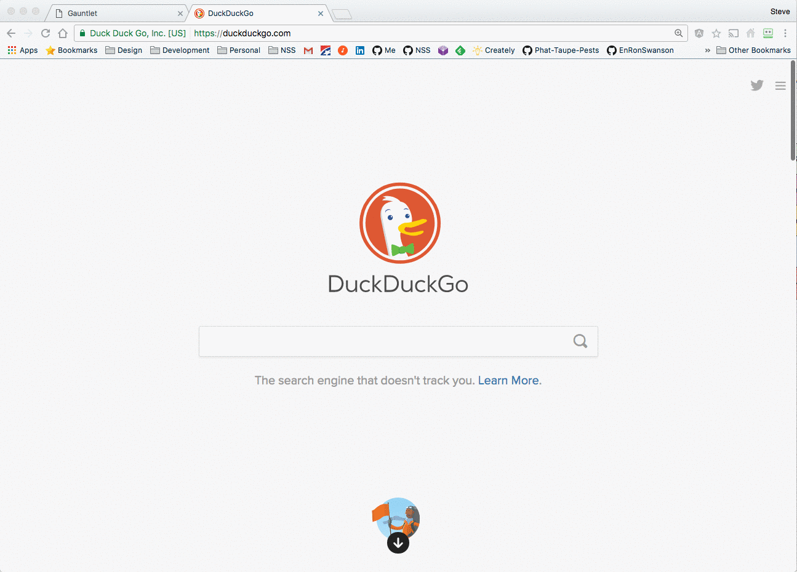

# Researching

Researching topics is a critical skill. It's a major component of Learning How To Learn. Luckily, we now have the entirety of the World Wide Web at our disposal. Unfortunately, with the colossal amount of information available, it can often be difficult to find the answers that you need.

## How to Search the World Wide Web

Start with this pattern:

> Language [optional: library] feature problem

Let's assume that you are getting an error in your JavaScript code that is looping over an array of strings.

```js
var animals = ["Dog", "Cat", "Bird", "Fish"];

for (var index = 0; index <= animals.length; index++) {
  var element = animals[index];
  console.log(element);
}

// Output
Dog
Cat
Bird
Fish
undefined
```

You're not sure why that `undefined` gets displayed. Your loop looks perfect. Ok, time to search the Web.



## Using Github

Searching Github is an often-overlooked avenue of research. It's not for finding answers to problems, or errors, that you have in your code, but it is invaluable to see examples of other developer's code that have solved the same problem you are trying to solve.

For example, you want to use a jQuery calendar tool that you found online - the jQuery UI DatePicker.

Search for some example code, and then look at someone's repository to see how they implemented it.


## Using DevDocs
Dev Docs is a searchable wiki that pulls in docs from many APIs all over the web.  [Dev Docs](https://devdocs.io/)
