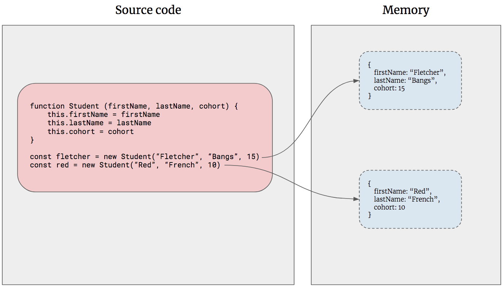

# Object Creation with the New Keyword

Object creation is the most critical thing that JavaScript developers do since our jobs have, largely, two main facets.

1. Querying and displaying data in a way that is consumable for people
1. Representing real-world people, things, and processes

Both of these facets involve creating objects.

1. Objects as a data structures
    ```js
    const person = {
        firstName: "Harper",
        lastName: "Frankstone",
        cohort: 18
    }
    ```
1. Objects for creating DOM elements
    ```js
    const personCard = document.createElement("article")
    personCard.textContent = `${person.firstName} ${person.lastName} was in cohort ${person.cohort}`
    personCard.className = "student"
    document.body.appendChild(person)
    ```
1. Objects with reponsbilities for our application to work
    ```js
    const DOMManager = Object.create(null, {
        appendElements: {
            value: function (elements, target) {
                const fragment = document.createDocumentFragment()
                for (const element of elements) {
                    fragment.appendChild(element)
                }
                target.appendChild(fragment)
            }
        },
        clearElements: {
            value: function (parentElement) {
                while (parentElement.firstChild) {
                    parentElement.removeChild(parentElement.firstChild)
                }
            }
        }
    })
    ```

All three of these examples create objects for a specific purpose. In JavaScript, there is yet another way to create objects. You can use the [`new` operator](https://developer.mozilla.org/en-US/docs/Web/JavaScript/Reference/Operators/new).

```js
/*
    This function is a template to use for creating objects.
    It takes three arguments which become properties on the
    resulting object.
*/
function Student (firstName, lastName, cohort) {
    this.firstName = firstName
    this.lastName = lastName
    this.cohort = cohort
}

const fletcher = new Student(“Fletcher”, “Bangs”, 15)
const red = new Student(“Red”, “French”, 10)
```



## Practice: Making Cars

The learning objective of this exercise is to create a series of objects with the `new` operator.

1. Write a function to be used as a template for creating a Car object.
1. The function should take three arguments.
    1. Manufacturer ("Ford", "Chevrolet", etc.)
    1. Model ("Mustang", "Impala", etc.)
    1. Model year
1. Using the `new` operator, create 4 cars that you would love to own.
1. Each car should be stored in a variable.

```js
// Resulting object structure
{
    manufacturer: "Ford",
    model: "Mustang",
    year: 1981
}
```

## Practice: Car Garage

The learning objective of this exercise is to create a single object with the `new` operator.

1. Write a function to be used as a template for creating a Garage object.
1. The function should take no arguments.
1. The function should define one property named `storage` and its default value should be an empty array
1. Use `new` to create a new instance of the object.

```js
// Resulting object
{
    storage: []
}
```

## Practice: Park the Cars

The learning objective of this exercise is to store object references inside the data structure of another object. You will also practice using the `push` method of an array.

Take your four car variables, and `push()` them into the `storage` array on your instance of Garage.

```js
// Example code
garage.storage.push(mustang)
```
