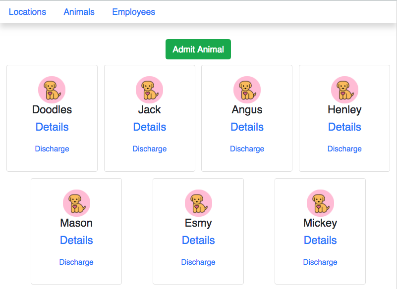
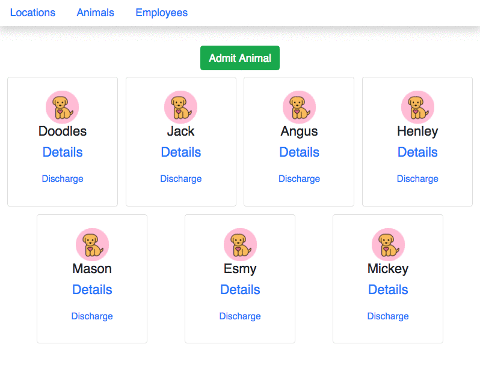

# Adding Animals with Forms in React

In this chapter, you are going to learn how to use use a form to express the state of a component, and then use a function to add the animal to the API and redirect to the full animal list.

**_Quick Note_:** All of the code you will see from here to the end of this chapter needs to be in place before the feature will work.

## Route for Showing Animal Form

Below is a new route that renders a form for boarding a new animal. You need to update the route for `/animals` to include the `...props` argument and pass it to the child component. This sets up the ability to use the helpful `history.push()` mechanism in the components themselves to change the URL in the browser.

First, update your routes in ApplicationViews with a new route for the form and add `{...props}` to the route `/animals` (**AnimalList**). The spread operator on the props gives access to the router properties, especially `history.push`

Remember, you'll also have to `import` the new AnimalForm component once it's created

```jsx
import AnimalForm from './animal/AnimalForm'
```

```jsx
// Our shiny new route.
<Route path="/animals/new" render={(props) => {
  return <AnimalForm {...props} />
}} />
```

```jsx
//updated route: `/animals`
<Route exact path="/animals" render={(props) => {
  return <AnimalList {...props} />
}} />
```


## Add a button for Admitting a New Animal

Update **`<AnimalList>`** with a button that uses the `history.push()` to change the URL of the browser. This will only work if you updated your routes correctly and have access to the router `props` object.

**NOTE** You will need to wrap the return in a React.Fragment. Remember, only one element can be returned.

> AnimalList.js


```js
//add this button above your display of animal cards
<section className="section-content">
  <button type="button"
      className="btn"
      onClick={() => {this.props.history.push("/animals/new")}}>
      Admit Animal
  </button>
</section>
```




## AnimalManager Method for POSTing Animal

Refactor your **`AnimalManager`** module with a `post` method that implements a `fetch()` for adding a new animal object to your API.

```js
post(newAnimal) {
    return fetch(`${remoteURL}/animals`, {
        method: "POST",
        headers: {
            "Content-Type": "application/json"
        },
        body: JSON.stringify(newAnimal)
    }).then(data => data.json())
}
```


## AnimalForm Component

Now it's time to make the **`<AnimalForm>`** component.

**Note** we are going to include a method `handleFieldChange()` that will update state every time the user types a character into any field. This is made possible by having **each input field's `id` property named exactly as each state property**.

Our component's inputs will render based on what is in state. Ultimately, we will collect what is in state and pass it to the `AnimalManager.post` method. This allows the UI and state to stay in sync.

In state, you will have three properties:

```
state = {
    animalName: "",
    breed: "",
    loadingStatus: false,
};
```

The input fields will have corresponding id's:

1. `<input id="animalName" ... />`
2. `<input id="breed" ... />`

We will also incorporate `loadingStatus` (Dynamic Routing Part 2) so a user cannot select the button multiple times.

> components/animal/AnimalForm.js

```js
import React, { Component } from 'react';
import AnimalManager from '../../modules/AnimalManager';
import './AnimalForm.css'

class AnimalForm extends Component {
    state = {
        animalName: "",
        breed: "",
        loadingStatus: false,
    };

    handleFieldChange = evt => {
        const stateToChange = {};
        stateToChange[evt.target.id] = evt.target.value;
        this.setState(stateToChange);
    };

    /*  Local method for validation, set loadingStatus, create animal      object, invoke the AnimalManager post method, and redirect to the full animal list
    */
    constructNewAnimal = evt => {
        evt.preventDefault();
        if (this.state.animalName === "" || this.state.breed === "") {
            window.alert("Please input an animal name and breed");
        } else {
            this.setState({ loadingStatus: true });
            const animal = {
                name: this.state.animalName,
                breed: this.state.breed,
            };

            // Create the animal and redirect user to animal list
            AnimalManager.post(animal)
            .then(() => this.props.history.push("/animals"));
        }
    };

    render(){

        return(
            <>
            <form>
                <fieldset>
                    <div className="formgrid">
                        <input
                        type="text"
                        required
                        onChange={this.handleFieldChange}
                        id="animalName"
                        placeholder="Animal name"
                        />
                        <label htmlFor="animalName">Name</label>
                        <input
                        type="text"
                        required
                        onChange={this.handleFieldChange}
                        id="breed"
                        placeholder="Breed"
                        />
                        <label htmlFor="breed">Breed</label>
                    </div>
                    <div className="alignRight">
                        <button
                        type="button"
                        disabled={this.state.loadingStatus}
                        onClick={this.constructNewAnimal}
                        >Submit</button>
                    </div>
                </fieldset>
            </form>
        </>
        )
    }
}

export default AnimalForm
```

**NOTE** `<>` is a shortcut for React.Fragment. Be sure to close it at the bottom `</>`

> AnimalForm.css

```css
fieldset {
    max-width: 40em;
    padding: 4px;
    margin: 2em auto;
    border: 0 none;
    box-shadow: 0 4px 8px 0 rgba(0,0,0,0.2);
    border-radius: 5px;
    background: aliceblue;
}

fieldset input, fieldset button{
    box-sizing: border-box;
    padding: .2em .4em;
    margin: .2em 0;
    outline: none;
    box-shadow: none;
}

fieldset button {
    max-width: 9em;
    padding: .5em;
    margin: .3em auto;
    background-color: cornflowerblue;
    border: none;
    color: cornsilk;
    text-align: center;
    text-decoration: none;
    display: inline-block;
    font-size: 14px;
    border-radius: 2px;
    width: 100%;
    cursor: pointer;
}

fieldset label {
    box-sizing: border-box;
    user-select: none;
    cursor: pointer;
}
fieldset input:focus + label {
    color: #933;
}

fieldset .formgrid {
    display: grid;
    grid-template-columns: 1fr 1em 2fr;
    grid-gap: .3em .6em;
    grid-auto-flow: dense;
    align-items: center;
}

fieldset input, fieldset button {
    grid-column: 2 /4;
    width: auto;
    margin: 0
}

fieldset .alignRight {
    text-align: right;
}
```

## Using the Form

Once you've got all these pieces in place, click on the _Admit Animal_ button, fill out the form, and submit it. You should immediately see your new animal in the list.



## Practice: Adding Employees, Owners, and Locations

1. Create forms for employees, owners, and locations.
1. Update **`EmployeeManager`**, **`OwnerManager`**, and **LocationManager** with methods to POST new objects to the API.
